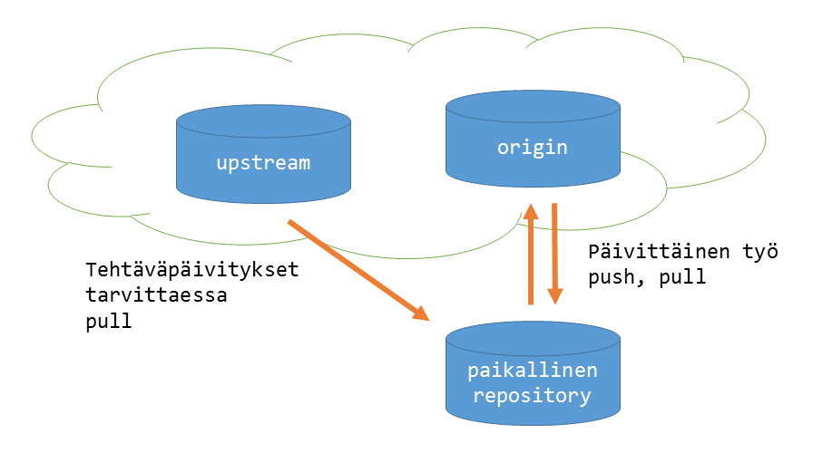

# JavaScript ohjelmoinnin perusteet

## Aloitus
- Asenna koneellesi [git](https://git-scm.com/downloads), jos sitä ei vielä ole 
- Kopioi tämän repositoryn osoite leikepöydälle ja kloonaa repository työhakemistoosi
```shell
$ git clone <repositoryn osoite>
``` 

## Tehtävien tekeminen
Jokaiseen tehtävään on valmiiksi toteutettuna ohjelmarunko, jossa perusrakenteet on jo toteutettu, ja voit keskittyä tehtävässä harjoiteltavana oleviin asioihin. Ohjelmointitehtävissä tehtävänäsi on siis täydentää ohjelmarunko toimivaksi ohjelmaksi. 


## Tehtävät

- [Tehtävä 00: Ympäristö kuntoon ja html-kertaus](t00/README.md)
- [Tehtävä 01: JavaScript perusteita ja DOM](t01/README.md)
- [Tehtävä 02: Ohjelmoinnin perusteita](t02/README.md)
- [Tehtävä 03: HTML5, CSS ja JavaScript](t03/README.md)
- [Tehtävä 04: Reaktiopeli](t04/README.md)
- [Tehtävä 05: Toistorakenteet ja funktiot](t05/README.md)

## Versionhallinta

Kun kloonaat repositoryn, saat paikallisen git-repositoryn, joka on identtinen esikuvansa kanssa tällä hetkellä. Voit käyttää tätä omaa kopiotasi täysin vapaasti, se on sinun. Paikallisessa repositoryssäsi voit työstää annettuja ohjelmapohjia vapaasti ja tehdä committeja. 

Jos tehtävärepositoryyn, josta paikallinen kopiosi kloonattiin, muuttuu, voit hakea ne sieltä omaan kopioosi. Komennolla `git fetch` saat tiedon, onko muutoksia tullut. Komennolla `git pull` saat uudet muutokset sulautettua (merge) omaan repositoryysi. Omia muutoksiasi et saa puskettua (`push`) tehtävärepositoryyn, sillä sinulle ei ole siihen oikeuksia.

## Oma etä-repository

Jos ja kun haluat oman työsi myös turvaan pilveen, toimi näin:
- Kloonaus asetti sinulle todennäköisesti remote-repositoryn nimeltä `origin`:
    ```console
    $ git remote -v
    origin  https://gitlab.com/markkuruonavaara/javascript-perusteet.git (fetch)
    origin  https://gitlab.com/markkuruonavaara/javascript-perusteet.git (push)
    ```

- `origin` on etä-repositoryn oletusnimi, lienee viisasta vaihtaa nimi sekaannusten välttämiseksi. Olkoon uusi nimi `upstream`:
    ```console
    $ git remote rename origin upstream
    ```
- Luo sitten käyttämäsi git-palvelun ohjeiden mukaisesti etä-repository. Kun se on olemassa, määritä oma etä-repositorysi nimelle `origin` ja puske paikallisen repositoryn `master`-haaran sisältö etä-repositoryyn:
    ```console
    $ git remote add origin <etärepositorysi osoite>
    $ git push -u origin master
    ```
### Vaihtoehtoinen tapa: fork

Git-palvelujen fork-toiminnallisuus tekee saman kuin edellä kuvattu proseduuri. Lähtökohtana siinä on, että kloonattavasta repositorystä tehdään ensin palveluun klooni (fork), sitten siitä kloonataan paikallinen kopio. Lue käyttämäsi git-palvelun ohjeista, miten se siellä tehdään. 

## Etärepositoryjen käyttö
Toimintapa on seuraavan kaltainen:
- teet päivittäiset työsi paikallisessa repositoryssä ja pusket ne `origin`-repositoryyn
    ```console
    $ git push origin master
    ```
- haet tarvittaessa tehtävämateriaalipäivitykset `upstream`-repositorystä.
    ```console
    $ git pull upstream master
    ```
  


