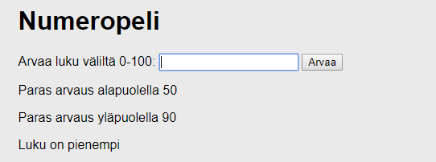
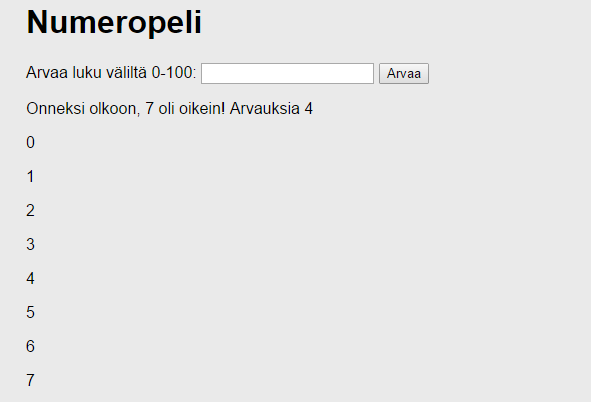

# Ohjelmoinnin perusteita

JavaScript on yleiskäyttöinen ohjelmointikieli siinä kuin moni muukin kuten
esim. Java, C++, C\#, Python, PHP yms. Ohjelmoinnin perusrakenteet ovat hyvin
samankaltaiset näissä kaikissa, mm. muuttujat, vertailuoperaattorit,
ehtolauseet, toistorakenteet. Jos osaat jotakin muuta kieltä, ainoa opiskeltava
asia on, miten ko. rakenteet laaditaan JavaScriptissa. Jos taas et osaa,
hankittu JavaScript-oppi auttaa muiden kielten omaksumisessa jatkossa.

Nyt tavoitteena on tutustua muutamaan keskeiseen rakenteeseen JavaScriptissa,
jotta pääset ohjelmoinnissa eteenpäin kohti mielenkiintoisempien ohjelmien
toteutusta ja pystyt paremmin itse opiskelemaan lisää.

## Ohjelmointitehtävä

Tehtävänä on klassinen ohjelmointiharjoitus numeronarvauspeli. Arvattava numero
arvotaan väliltä 0-100. Pelaajan annettua arvauksensa peli kertoo, onko
arvattava luku suurempi vai pienempi.

Peli myös näyttää, mikä on ollut tähän asti paras arvaus ala- ja yläpuolella.
Jos pienempiä tai suurempia arvauksia ei vielä ole, ei näytetä mitään. Jos
pelaaja tekee entistä huonomman arvauksen, näytettävät arvaukset eivät muutu.

Kun pelaaja osuu oikeaan, peli kertoo arvausten määrän ja luettelee kaikki
numerot nollasta oikeaan vastaukseen.

Pelin saa tyylitellä aivan vapaasti niin hienoksi kuin osaa!

## Kysymyksiä

1.  Selitä

    -   mikä on muuttuja (variable) ja miten sellainen määritellään
        (JavaScriptissa),

    -   miten muuttujalle voidaan antaa arvo,

    -   miten muuttujan arvo voidaan hakea ohjelmassa.

2.  Selitä, miten If-else –lause toimii ja miten sellainen laaditaan
    JavaScript-kielellä. Anna esimerkkejä ja selitä esimerkkisi.

3.  Selitä, miten while-lause toimii ja miten sellainen laaditaan
    JavaScript-kielellä. Anna esimerkkejä ja selitä esimerkkisi.

4.  Mitä muita toistorakenteita kielessä on?

5.  Selitä

    -   mikä on funktio ja miten sellainen määritellään JavaScriptissä,

    -   mikä on funktion parametri (parameter) ja miten sille voidaan antaa arvo
        (argument),

    -   mikä on funktion paluuarvo ja miten se asetetaan.

## Bonustehtäviä

Haasta itsesi bonustehtävillä päästäksesi nextille levelille! Se voi näkyä lisääntyneenä oppimisena.

1.  Pelin uudelleenkäynnistys: Lisää sivulle nollausta varten jokin sopiva
    elementti, määrittele funktio, joka alustaa pelin uudelleen ja aseta funktio
    uuden elementin onclick-käsittelijäksi.

2.  Arvausten visualisointi: Tehtäväpohjassa on ovela palkkirakennelma, jolla
    voi visualisoida arvausten tiivistymistä kohti oikeaa vastausta:

    

    Palkki koostuu sisäkkäisistä elementeistä, joiden pituutta säädetään
    muuttamalla elementtien leveyttä prosenttiosuutena koko palkin leveydestä
    (joka on siis 100%). Tässä esimerkkitapauksessa siis sinisen osuus on 21%,
    vihreän 34% ja keltaisen saakin jo laskettua.

    Lisää ohjelmaan palkin päivitys sitä mukaa, kun pelaajan arvaukset etenevät
    vääjäämättä kohti oikeaa vastausta.

## Palautus

-   Dokumentti, jossa ryhmän nimi, ryhmän jäsenten nimet, vastaukset kaikkiin
    kysymyksiin

-   Linkki esittelysivustolle, jolla linkki toimivaan ohjelmaan (omalla
    O-levyllä)

>   Kuten ennenkin, vaikka tulokset on tehty tiimityönä, jokainen lähettää
>   erillisen vastauksen ja asentaa ohjelmat omaan serverihakemistoonsa! Arvioi
>   vastauksesi tekstikentässä omaa panostasi sprintin lopputuloksen
>   saavuttamisessa ja oppimistasi. Jos jokin tuntui hankalalta, mainitse
>   siitäkin.

## Vinkkejä

-   Kurssin hakemistossa on pohja sprintin ohjelmointitehtävään. Pohjan koodin
    kommentit antavat osviittaa ratkaisun laatimiseen, lue pohja ajatuksella!

-   W3Schools-tutoriaali auttaa tässäkin, mutta tämänkertaisiin kysymyksiin
    löytyy myös Mozilla Developer Networkin materiaaleista aivan erityisen osuva
    artikkeli:
    <https://developer.mozilla.org/en-US/docs/Learn/Getting_started_with_the_web/JavaScript_basics>

-   Muista myös tämän opintojakson ohjelmointiohje ItsLearningissa, sekin voi
    osoittautua hyödylliseksi.

