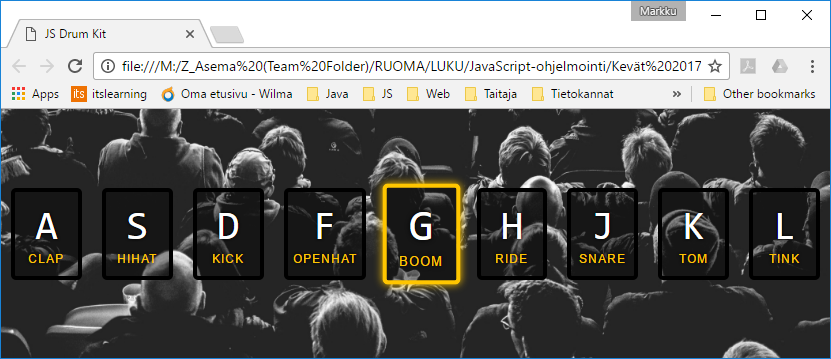
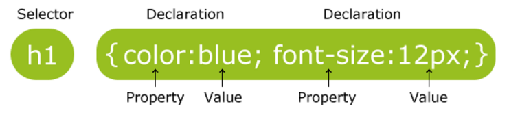

# HTML5, CSS ja JavaScript

HTML5, CSS3 ja JavaScript ovat yhdessä dynaaminen trio. Niillä saa kehiteltyä
hämmästyttävän hienoja juttuja hyvinkin pienellä ohjelmoinnilla, jos vain tietää
mitä tahtoo ja osaa käyttää niitä hyväkseen.

Tässä sprintissä tutustutaan eräisiin HTML5- ja CSS-ominaisuuksiin, joilla voi
toteuttaa dynaamisia ominaisuuksia ilman riviäkään JavaScriptia, siis ilman
ohjelmointia. 

JavaScript Domain Object Model (DOM) on määritelty standardissa, mutta toteutukset vaihtelevat, ja kaikki ohjelmat eivät kuitenkaan toimi ihan samalla tavalla kaikissa selaimissa. 

Selainyhteensopivuus on hyvä tarkistaa kaikkien
käytettävien ominaisuuksien osalta varsinkin, jos on oleellista, että sivu
toimii eri selaimilla. Muista myös selainten eri versiot, niitä on käytössä
useita yhtaikaa!

Etenkin uudempien HTML5- ja
CSS-ominaisuuksien tuessa eri selaimissa saattaa olla eroja. Niitä voit tarkistaa esim. sivustolta
<http://caniuse.com> . Sivustolla <http://doiuse.herokuapp.com/> voit tarkistaa,
käytätkö ominaisuuksia, jotka eivät toimi yleisesti käytössä olevilla selaimilla

## Ohjelmointitehtävä

Ohjelmointitehtävänä on toteuttaa rumpusetti, jota voi soittaa näppäimistöllä.



Rumpuja soitetaan kuvan mukaisilla näppäimillä. Ohjelmoitavana on kaksi
toiminnallisuutta:

1.  tietyn äänen soittaminen, kun näppäintä painetaan

2.  rummun lyöntiä visualisoiva animaatio (ks. yllä)

### Näppäimistöpainallusten tunnistaminen

Aloita näppäimistöpainallusten nappaamisesta. Pääset näppäimistö-eventteihin pääset käsiksi `document`-olion kautta. 

Selaimen näppäimistöpainallukset aiheuttavat `keydown`-eventtejä. Aseta
dokumentille keydown-tapahtumankäsittelijä. Tapahtumankäsittelijä voi aluksi
vaikkapa tulostaa koko eventin tiedot konsoliin, sieltä näet, että painetun
näppäimen voi tunnistaa eventin `keyCode`-attribuutin arvosta.

```javascript
document.addEventListener('keydown', playSound);
```

Ylläolevassa playSound on funktio, jota kutsutaan aina keydown-eventin
tapahtuessa. Se sinun pitää määritellä itse vaikkapa näin:

```javascript
function playSound(event) {
    console.log(event.keyCode);
}
```

### Äänen soittaminen

Seuraavaksi olisi saatava funktiomme soittamaan jotain. HTML5-tag audio osaa
soittaa ääniä, ja HTML-koodissamme onkin jo joka äänelle sellaiset valmiina.
Elementeillä on jo valmiina attribuutti `data-key`, jonka arvona on se
näppäinkoodi, mitä elementti edustaa.

Tästä edetään kuten aina ennenkin: hae oikeaa audio-elementtiä vastaava DOM-olio
ja kutsu sitten DOM-olion metodia `play()` audio-elementille. Mitään
soitinlisäosia ei tarvita, HTML5 ja selain hoitavat homman!

Tarvitset siis näppäinkoodia vastaavan audio-elementin, sen löydät vaikkapa
näin:
```javascript
var selector = 'audio[data-key="' + keyCode + '"] ';
var audio = document.querySelector(selector);
```

Selektori hakee siis audio-elementin, jolla on attribuutin `data-key` arvona
`keyCode` (joka on siis sinun oma muuttujasi, sijoita siihen painetun näppäimen
näppäimistökoodi).

Kaikkia näppäinkoodeja vastaavia elementtejä ei kuitenkaan ole, joten varaudu
siihen, että audio-elementti on `null`. Jos se ei ole `null`, aseta soitin
ääninäytteen alkuun ja soita se:
```javascript
if (audio !== null) {
    audio.currentTime = 0;
    audio.play();
}
```

Jos kaikki meni putkeen, rumpusettisi jo toimii.

### Visuaalinen efekti

Entä visualisointi? Se tehdään nerokkaasti CSS-tyyleillä, jotka ovat jo kaikki
valmiiksi määriteltyinä. Kaikilla näppäinelementeillä on class key.
Korostusefekti saadaan aikaan lisäämällä aktiiviselle elementille myös `class`
`playing` ja ottamalla se sitten pois. Kokeile vaikka selaimessa.

Dynaaminen efekti tulee tällä valmiiksi määritellyllä CSS-säännöllä:
```css
transition: all .07s ease;
```

Pidennä aikaa niin efekti tapahtuu hitaammin ja näet, mitä tapahtuu. Kun
elementin tyylitransitio on valmis, elementti tekee eventin `transitionend`. Kun
se tapahtuu, poistetaan elementiltä `class` `playing`, ja näppäinelementti palaa
ennalleen.

Kirjoita ohjelmasi näin: kun näppäintä painetaan, hae oikea näppäinelementti
samaan tapaan kuin hait audio-elementin edellä ja lisää siihen `class` `playing`:
```javascript
key.classList.add('playing');
```

Lisää aktiivisen näppäimen poistamista varten jokaiselle näppäinelementille
event-käsittelijä `transitionend`-eventille. Siis hae kaikki elementit, joilla on
`class` `key` ja aseta niille event-käsittelijä:
```javascript
var keys = document.querySelectorAll('.key');
keys.forEach(function(key) {
    key.addEventListener('transitionend', revertStyle);
}
```

Funktio `revertStyle` pitää määritellä:
```javascript
function revertStyle(event) {
    if (event.propertyName === 'transform') {
        this.classList.remove('playing');
    }
}
```

Jos tässä kaikki onnistui, efektitkin toimivat.

### Oliko liian pitkä selostus?

Tämän harjoituksen on laatinut Wes Bos ja se kuuluu ilmaiseen
JavaScript-kurssiin nimeltä JavaScript30. Jos edellä oleva selitys tuntui liian
pitkältä, voit rekisteröityä kurssille osoitteessa <https://javascript30.com/>
ja ratkaista tehtävän itsensä Wesin opastamana.

## Kysymyksiä



>   Kuva 1 CSS-säännön syntaksi (http://www.w3schools.com/css/css_syntax.asp)

1.  Ohjelmointitehtävässä esiintyvät seuraavat selektorit. Selitä kustakin,
    mihin elementteihin niihin liittyvät säännöt kohdistuvat:

    ```
    body,html {…}
    .keys {…}
    audio[data-key="65"] {…}
    .key[data-key=”71” {…}
    ```

    Selitä myös tehtävässä 1 esiintyneet

    ```
    #laskuri {…}
    * {…}
    ```

2.  Ohjelmointitehtävässä ei käytettykään DOM-olioiden hakuun aiemmista
    tehtävistä tuttuja metodeja ```document.getElementById()``` ja
    ```getElementsByClass()``` vaan metodeja ```document.querySelector()``` ja
    ```document.querySelectorAll()```. Selitä, miten ne toimivat.

3.  Testaa ohjelmasi ainakin kolmella eri selaimella ja raportoi tulokset.
    Vihje: testiraportista pitää selvitä ainakin, millä selaimilla ja
    selainversoilla testattiin, ja jos jokin ongelma löytyi, mikä ei toiminut.

4.  HTML-elementti `audio` osaa äänitiedostojen soittamisen lisäksi tarjota myös
    soittimen ohjauskontrollit (play, pause, stop jne.). Kokeile soittimen
    upottamista jollekin web-sivulle ja anna linkki sivullesi.

5.  Audio-elementti on HTML5-ominaisuuksista vain yksi. Esittele kolme muuta 
    mielestäsi kiinnostavaa HTML5-ominaisuutta ja kerro lyhyesti, mitä niillä
    voi tehdä.

## Palautus

-   Dokumentti, jossa ryhmän nimi, ryhmän jäsenten nimet, vastaukset kaikkiin
    kysymyksiin

-   Linkki esittelysivustolle, jolla linkki toimivaan ohjelmaan web-palvelimella.

Arvioi vastauksesi tekstikentässä omaa panostasi lopputuloksen
saavuttamisessa ja oppimistasi. Jos jokin tuntui hankalalta, mainitse siitäkin.

>   Vaikka tulokset olisikin tehty tiimityönä, jokainen lähettää
>   erillisen vastauksen ja asentaa ohjelmat omaan serverihakemistoonsa! 

## Bonustehtäviä

Haasta itsesi bonustehtävillä päästäksesi nextille levelille! Se voi näkyä lisääntyneenä oppimisena.

Jos kokeilit rumpusettiä puhelimella, huomasit varmaankin, että se ei toimi,
koska puhelimessa ei ole näppäimistöä eikä keydown-eventtejä synny. Tee
rumpusetistä myös hiirellä soitettava, jolloin se toimii ainakin joillain
mobiiliselaimilla.

## Vinkkejä

-   Kuten tekstistä jo selvisi, ohjelmointiharjoitus kuuluu ilmaiseen
    JavaScript-kurssiin nimeltä JavaScript30. Voit rekisteröityä kurssille
    osoitteessa <https://javascript30.com/> . Wes Bosin ohjevideo löytyy myös
    Youtubesta.

-   CSS-selektoreista löydät tietoa vaikkapa W3Schoolsista
    <http://www.w3schools.com/css/default.asp>

-   Toinen oivallinen tutoriaalisivusto on <http://www.quackit.com/> . Se on
    tyyliltään pikemminkin reference kuin tutorial, joten se soveltuu hyvin
    yksityiskohtien selvittämiseen.

-   Audio-tag on hyvä esimerkki HTML5-ominaisuuksista, tässä siitä materiaalia:
    <https://www.htmlgoodies.com/primers/html/article.php/3920991/HTML5-Primer-How-To-Use-the-Audio-Tag.htm>
