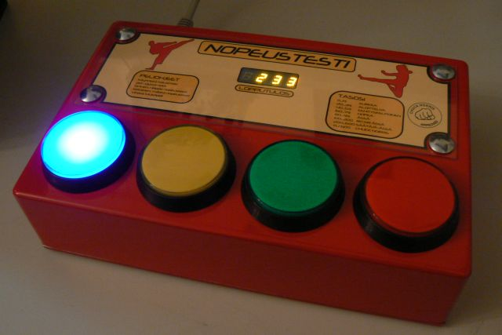
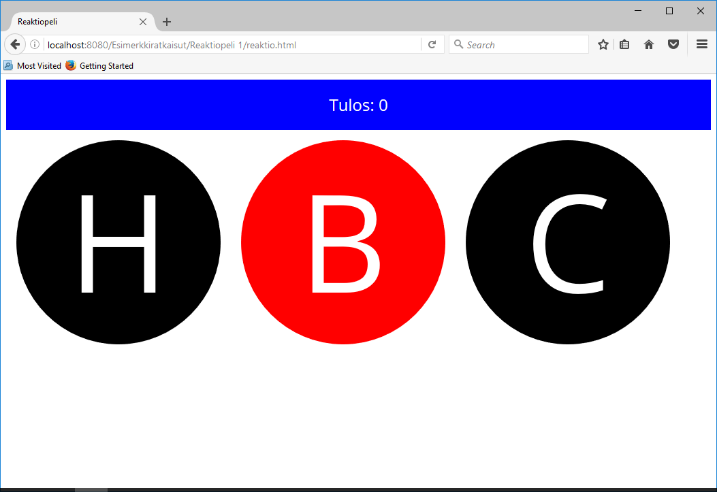
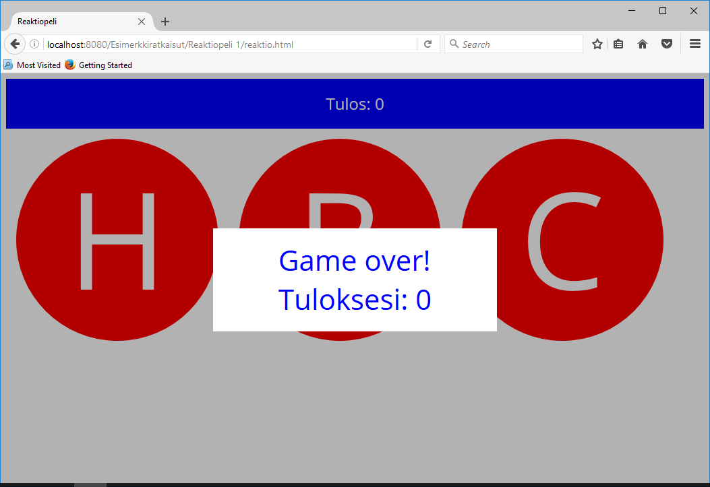

# Reaktiopeli



Tehtävänä on reaktiopeli, jossa tehtävänä on painaa sitä nappulaa, jonka valo
syttyy. Jokaisesta oikeasta painalluksesta saa pisteen, väärä painallus lopettaa
pelin. Nappuloiden vaihtumisnopeus kiihtyy jatkuvasti.
(https://www.youtube.com/watch?v=nv_Wfhz38EM).


## Perusversio



Pelin perusversiossa ei tarvitse olla muistia, nappulaa on siis ehdittävä painaa
ennen kuin seuraava syttyy.

Peli loppuu, jos pelaaja painaa väärää nappulaa tai ei ehdi painaa ennen kuin
nappula vaihtuu. Jokaisesta oikeasta painalluksesta saa pisteen. Pelin tulee
vaikeutua jatkuvasti: mitä pidemmälle pelaaja pääsee, sitä nopeammin nappulat
vaihtuvat.

Tehtäväpohjassa on kolmen nappulan pelin runko, jolla pääset suoraan
toteuttamaan pelin logiikkaa, sillä perustoiminnallisuuden palaset ovat jo
olemassa.

## Tehtävät

1.  Toteuta peli. Kuten aina, saat tyylitellä sivun miten haluat ja tehdä
    lisäominaisuuksia, esim. järisyttävät Game over –animaatiot tai -fanfaarit
    tms.

    Vastaa lisäksi seuraaviin kysymyksiin:

1.  Mikä on taulukko (_array_) ja miten sellainen määritellään JavaScriptissa? Miten sitä
    käytetään?

2.  Laadi esimerkkikoodi, jossa

    1.  luodaan tyhjä taulukko

    2.  lisätään siihen alkioita loppuun

    3.  poistetaan alkioita lopusta

    4.  poistetaan alkioita alusta

    5.  lisätään alkioita alkuun

    Kommentoi kukin kohta niin, että asiaa tuntemattomallekin selviää, mitä missäkin
    vaiheessa tapahtuu. Käytä rivikommentteja:

    ```javascript
    // tästä rivin loppuun on kommenttia
    ```

1.  Edellä tuli ilmi joitakin `Array:n metodeja. Luettele kymmenen `Array`:n
    metodia lisää, jotka mielestäsi ovat hyödyllisiä. Selitä kustakin lyhyesti,
    mitä metodi tekee.

## Vinkkejä

-   Tehtävässä tarvitaan taulukoita. Jos ei niitä tunne, kannattaa ensin
    perehtyä hieman asiaan.

-   Tutoriaali <http://www.w3schools.com/js/> antaa näihinkin kysymyksiin
    vastaamiseen hyvät eväät.

-   Tehtäväpohja osaa jo kaikenlaista, sen toimintaan kannattaa perehtyä ennen
    kuin alkaa toteuttaa peliä. Varsinainen pelilogiikka puuttuu, sen laatiminen
    on sinun tehtäväsi.

-   Mieti, mitä pitää tehdä, lisää yksi pieni toiminto kerrallaan, kokeile, ja
    sitten kun se on kunnossa, etene seuraavaan toimintoon.

-   Usko tehtäväpohjan kommenteissa kerrottuja vihjeitä, ellet halua toteuttaa
    koko peliä alusta itse uudelleen.

-   Älä kopioi jostain googlelöydöksestä koodia, jota et ymmärrä!

## Variaatioita

### Edistynyt versio

Alkuperäisessä reaktiopelissä ei ole väliä, milloin painat nappulaa, kunhan
painallukset tulevat oikeassa järjestyksessä. Pelaaja voi siis jäädä jälkeen
nappuloiden vaihtumisista. Tämä on oikeastaan pelaajalle aika vaikeaa.

Paremman pelikokemuksen saat, kun toteutat peliin muistin, joka muistaa kymmenen viimeisintä
nappulaa edellisen painalluksen jälkeen. Pelaaja saa pisteitä, jos painaa
nappuloita oikeassa järjestyksessä ja peli loppuu väärään painallukseen tai
siihen, että muisti tulee täyteen, pelaaja on siis yli kymmenen painallusta
jäljessä.

### Hi-score

Toteuta peliin hi-score -board, joka tallettaa parhaat tulokset (esim. 10
parasta) ja näyttää ne pelin loputtua.

Tätä varten pitää pelin loppuessa tarvittaessa kysyä pelaajan nimi, ja tiedot
pitää tallettaa pysyvästi, jotta ne eivät katoa sivun uudelleenlatauksessa.
Siihen voit käyttää vaikkapa selainkohtaisesti tallentuvaa localStorage-oliota
(http://www.w3schools.com/html/html5_webstorage.asp)



