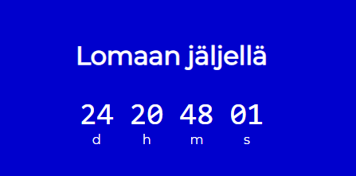
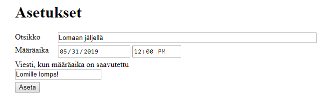

# Oliot ja JSON

## Johdanto olioihin
Yksi JavaScriptin tietotyypeistä on olio (_object_). Muut tietotyypit (_number, string, boolean, null, undefined, symbol_) ovat ns. primitiivisiä tietotyyppejä, niissä muuttujalla on vain yksi arvo. Olio on ns. rakenteinen tietotyyppi, siihen voi kuulua kuinka monta arvoa hyvänsä, ja arvot voivat olla mitä tyyppiä hyvänsä. 

Olioita käytetään kaiken aikaa. Aina, kun kirjoitat jtoain tyyliin `jokin.jotain`, käytät oliota: `jokin` on se olio, ´jotain´ on sen ominaisuus (_property_), jota käytät, joko muuttuja tai funktio. Olioon kuuluvaa funktiota kutsutaan useimmiten metodiksi. Olioon kuuluvaa muuttujaa kutsutaan usein attribuutiksi.

Olion data muodostuu avain-arvo -pareista (_key-value_). Voit määritellä olioita literaaleina asettamalla avaimia ja arvoja:
```javascript
const user = {
    name: 'martti',
    age: 24,
    admin: false
}
```

Uusia avaimia voi myös määritellä dynaamisesti (ajoaikaan) ihan vain sijoitusoperaatiolla:
```javascript
user.karma = 128;
```

Arvoihin pääset käsiksi pistenotaatiolla `user.name` tai taulukoista tutulla viittaussyntaksilla `user['name']`. Kuten aiemmin mainittiin, arvoina voi olla mitä tahansa, vaikkapa toisia olioita tai funktioita.

## JSON
Usein tulee tarve muuttaa systeemin sisältämiä tietoja tekstiksi esim. toisaalle lähettämistä varten, sillä datansiirtomenetelmät (kuten HTTP) usein perustuvat siihen, että data on tekstiä. Oliot ovat tässä suhteessa haastavia, sillä niiden arvojen tyyppi voi olla mitä tahansa, ja ne voivat olla mitä vain, vaikkapa toisia olioita. Olio muodostaakin puurakenteen, jossa haarat ovat olioita ja lehdet primitiivityyppisiä arvoja.

JSON (_JavaScript Object Notation_) on juuri tähän tarpeeseen (_sarjallistaminen, serialization_) laadittu formaatti, jolla voidaan esittää JavaScript-olio tekstinä. Esimerkkioliomme JSON-muodossa esitettäisiin näin:
```
{ 
    "name": "martti",
    "age": 24,
    "admin": false
} 
```
Kuten huomaat, formaatti muistuttaa JavaScript-olioliteraalisyntaksia. Eroja ovat:
- Attribuuttien nimet ovat merkkijonoja lainausmerkeissä `""`.
- Merkkijonot ovat aina lainausmerkeissä `""`.

Muitakin eroja on, esim. se, että JSON on vain dataa, joten metodeja sillä ei voi sarjallistaa.

Muunnos oliosta JSONiksi ja päin vastoin onnistuu helposti JSON-olion metodeilla:
- `JSON.stringify(user)` antaa `user`-olion JSON-esityksen
- `JSON.parse(userJSON)` muuntaa `userJSON`-merkkijonon taas olioksi

## Päivämäärien käsittely
Päivämäärien ja aikojen käsittely on ohjelmoinnissa hankalampi asia kuin ensi alkuun luulisi, sillä päivämääriä ja aikoja määritetään ja esitetaan lukuisin eri tavoin, ja lisäksi tulevat vielä aikavyöhykkeiden aiheuttamat komplikaatiot. 

Tästä syystä tyypillisesti päivämäärät ja ajat muunnetaan sisäisesti Unix Time Stamp -muotoon, jossa ajanhetki esitetään kuluneina millisekunteina ajanhetkestä 1.1.1970 klo 00.00 UTC. Näin tekee myös JavaScriptin Date-luokka.

Sisäinen esitys voidaan sitten kirjastofunktioiden avulla esittää toivotussa muodossa. Vastaavasti tarjolla on toimintoja, joilla päivämäärien, kellonaikojen ja niiden yhdistelmien merkkijonoesityksiä voidaan tulkita ajanhetkiksi.

Ajanhetkien välin määrittämistä kutsutaan päivämääräaritmetiikaksi. Unix Time Stamp -muodolla se on yksinkertaista, koska lasketaan vain sekunteja. Haasteellista on sitten esittää aikavälin suuruus halutussa ihmiselle sopivassa muodossa. Mitä esimerkiksi merkitsee 3902052744 millisekuntia? _(45 päivää 3 tuntia 54 minuuttia 12.744 sekuntia)_. 

## Ohjelmointitehtävä
Tehtäväpohjassa on esimerkkitoteutus HTML-sivuista ja niiden tyyleistä, mutta kaikki JavaScript puuttuu. Voit muuttaa esimerkkitoteutusta mielesi mukaan, kunhan tehtävän määrittely vain toteutuu. 
### Aikavälin laskenta
Toteuta funktio `duration(from, to)`, jossa parametrit `from ja `to` ovat `Date`-olioita ja joka palauttaa aikaleimojen välin JavaScript oliona muotoa
```javascript
{
    d: 3,   // päivää
    h: 11,  // tuntia
    m: 32,  // minuuttia
    s: 2    // sekuntia
}
```

### Countdown-laskuri
Tehtävänäsi on ohjelmoida countdown -laskuri, joka laskee jäljellä olevaa aikaa johonkin ennalta määritettyyn määräaikaan, esim. loman alkamiseen.



Kun määräaika on saavutettu, sivu näyttää ennalta määritetyn viestin.


### Konfigurointisivu

Tee laskurille myös konfigurointisivu, jolla voi asettaa:
- laskurisivun otsikon
- määräpäivän ja ajan
- Tekstin, joka näytetään, kun määräaika on saavutettu.



Jotta konfiguraatio säilyisi, vaikka selain suljettaisiin, talleta se selaimen localStorageen. localStorage on yksinkertainen tietovarasto, johon voi tallettaa tekstiarvoja avaimille. Tiedot säilyvät selaimessa selainkohtaisesti.

Saat konfiguraatiosi kätevästi talteen, kun teet siitä JavaScript-olion, muutat sen tekstiksi ja panet sellaisenaan localStorageen. Voit sitten sivua ladatessasi käydä lukemassa konfiguraation ja alkaa päivittää laskuria konfiguraatiotietojen mukaisesti. 

Jos konfiguraatiota ei ole, ohjaa käyttäjä konfiguraatiosivulle (_redirect_). Kun konfiguraatiosivulla on saatu konfiguraatio onnistuneesti talletettua, ohjaa käyttäjä laskurisivulle.

## Kysymyksiä
Tällä kertaa kysymykset on muotoiltu pieniksi ohjelmointiharjoituksiksi. 

1. Laadi sivu, jossa määrittelet literaalin oliolle ja tulostat sen konsoliin. Oliolla tulee olla seuraavat ominaisuudet ja arvot:
   - nimi, arvona olio, jolla on ominaisuudet etunimi ja sukunimi
   - ika, arvona numero
   - sukupuoli, arvona merkkijono
   - harrastukset, arvona lista, jossa on merkkijonoja
   - jasen, arvona totuusarvo

2. Lisää edellisen tehtävän sivulle olion tulostus sivulle JSON-muodossa.

2. Laadi sivu, joka toteuttaa seuraavat toiminnot ja tulostaa jokaisen toiminnon jälkeen olion konsoliin
   - luo tyhjä olio
   - lisää oliolle ominaisuus etunimi ja anna sille arvo Magnus
   - lisää oliolle ominaisuus sukunimi ja anna sille arvo von Wright
   - Muuta ominaisuuden etunimi arvoksi Ferdinand
   - Poista ominaisuus etunimi oliosta. 

3. Laadi sivu, jolla 
käyttäjä voi syöttää JSON-merkkijonon,
ohjelma muuttaa merkkijonon JavaScript-olioksi ja tulostaa sen konsoliin.

## Palautus

Palauta linkki nettisivuun ja linkki repositoryysi.

Palauta kysymysten (ohjelmointiharjoitusten) vastaukset repositorysi answers-kansioon.

## Ohjeita

### Lähteitä
- https://javascript.info/object-basics
- https://developer.mozilla.org/en-US/docs/Learn/JavaScript/Objects/JSON
- https://developer.mozilla.org/en-US/docs/Web/API/Window/localStorage
- https://developer.mozilla.org/en-US/docs/Web/JavaScript/Reference/Global_Objects/Date

### Lomakkeen käsittely JavaScriptissä
Esimerkkitoteutuksessa konfiguraatiotiedot kerätään HTML-lomakkeella. 

JavaScript-ohjelmassa emme usein halua lähettää lomaketta lainkaan vaan käsittelemme sen paikallisesti JavaScript-ohjelmassa, koska lomakkeen lähetys aiheuttaisi sivunlatauksen.

Jos lomakkeen submit-käsittelijä kutsuu lomakeolion `preventDefault()`-metodia, lomaketta ei lähetetä.

### En tiedä, mistä aloittaa
Pura ongelma pienemmiksi osaongelmiksi, ja ratkaise ne yksi kerrallaan. Vaikkapa näin:
- Kirjoita ensin duration-funktio ja testaa se konsolitulostuksilla.
- Tee sitten pääsivusta versio, joka näyttää jonkin aikavälin sivulla (aina saman, konfigurointi tehdään myöhemmin).
- Lisää sivun päivitys määrävälein.
- Siirry sitten konfigurointisivulle: tee ensin lomakkeelle yksinkertainen käsittelijä ja kokeile, miten saat lomakkeen luettua.
- Kun lomakkeen luku on kunnossa, tee tietojen talletus localStorageen.
- Nyt voit lisätä pääsivulle konfiguraation lukemisen localStoragesta.
- Kun nuo ovat kunnossa, voit säätää sivujen uudelleenohjaukset: pääsivu ohjaa konfigurointisivulle, jos konfiguraatiota ei ole, ja konfiguraatiosivu ohjaa pääsivulle, kun konfiguraatio on talletettu.
- Sitten voit vielä lisätä konfiguraatiosivulle lomakkeen esitäytön nykyisen konfiguraation tiedoilla, se olisi ystävällistä käyttäjälle.

Ja niin edelleen, asia kerrallaan! Kun vastaan tulee asia, jota et osaa tai muista, selvitä se etsimällä sopivia lähteitä hakukoneella. Tähän ohjeeseen on koottu valmiiksi jo muutama. 

